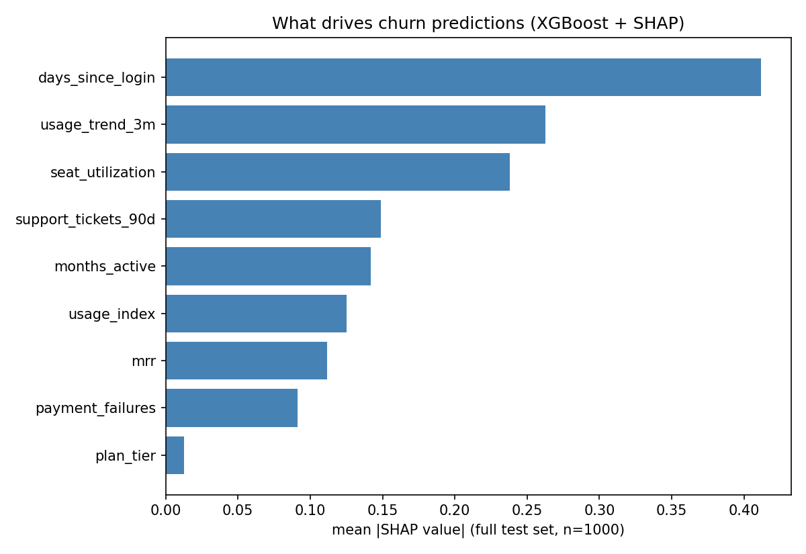

# saas-churn-radar

Predict which B2B SaaS accounts will churn at renewal - and explain *why*, in a way a non-technical VP can read (SHAP).

## What it does

1. **Dataset** (`src/churn/synthesize.py`): 5,000 customer accounts with realistic engagement, billing, and support features. Synthetic on purpose: fully reproducible from a seed, no license questions about someone else's data, and the churn drivers mirror what we actually see in B2B SaaS (usage decay, underused seats, payment friction, support load). Swap in your own customers via the same schema - nothing downstream cares where the rows came from.
2. **Model** (`src/churn/model.py`): XGBoost classifier with a small deterministic hyperparameter grid (validation AUC), 80/20 stratified split, evaluated on held-out accounts.
3. **Explanations**: SHAP values show which features drive each prediction; the summary chart ranks them.
4. **Dashboard** (`app.py`): Streamlit app - pick any account and see its predicted churn probability plus a per-account SHAP waterfall, i.e. the "why" in a form a non-technical VP can read.

## Results (v2)

- Test AUC: **0.734** · test accuracy at p>0.5: 0.727 · churn rate in test set: 34.5%
- Tuning was a small deterministic grid over `max_depth` x `learning_rate` (validation AUC); it selected depth 3, lr 0.05 - the honest result is that with only 9 features there isn't much headroom to chase.
- Top drivers of churn predictions (mean |SHAP|): `days_since_login`, `usage_trend_3m`, `seat_utilization` - i.e. engagement decay and underused seats, which matches operational intuition.



## Account risk dashboard

```bash
streamlit run app.py     # from the repo root, after training (artifacts/model.joblib must exist)
```

Pick any of the 5,000 accounts and it shows the predicted churn probability, the actual outcome, every feature's value with its SHAP contribution for that account, and a waterfall plot of how the prediction was built up from the base rate. That last part is the piece you can show a VP: not "the model says 78%", but "here are the three reasons".

## Layout

```
data/curated/   saas_customers.csv (committed, reproducible from seed 42)
src/churn/      synthesize.py (dataset), model.py (train + SHAP)
tests/          unit tests - run with pytest
app.py          Streamlit account risk dashboard
artifacts/      trained model (gitignored)
output/         generated charts
```

## Run it

```bash
python -m venv .venv
.venv\Scripts\pip install -r requirements.txt pytest   # Windows; use bin/pip on Linux/macOS
set PYTHONPATH=src                                      # Windows (or export PYTHONPATH=src)

# regenerate the dataset if you ever change the generator
python -c "from churn.synthesize import generate; generate(5000, seed=42).to_csv('data/curated/saas_customers.csv', index=False)"

python -m churn.model     # trains (grid + final fit), prints AUC, writes output/shap_summary.png
streamlit run app.py      # per-account risk dashboard (needs artifacts/model.joblib)
python -m pytest tests/
```

## Known simplifications (v2)

- SHAP now uses the native `TreeExplainer` over the full held-out set. xgboost 3.x serializes `base_score` as a stringified array, which trips up shap's model loader; `model.py` carries a small `_FixedBooster` shim that rewrites that one field in the raw dump (it no-ops automatically if upstream ever fixes it).
- Tuning is a 6-config grid, not Optuna - with 9 features and ~4k rows there was little to optimize; the grid exists so the numbers are reproducible without a search budget.
- Single renewal window per account; no time-series features yet. Next step: monthly usage panels and a survival-model comparison.
